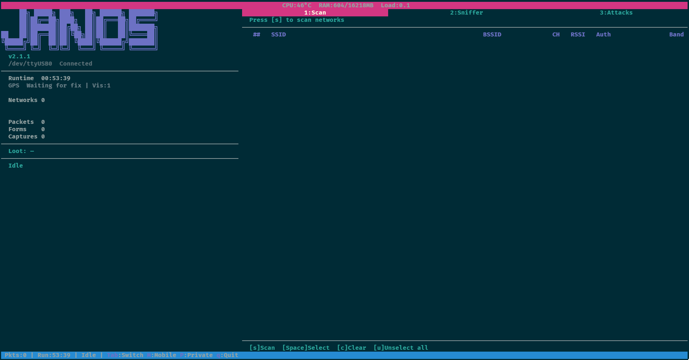
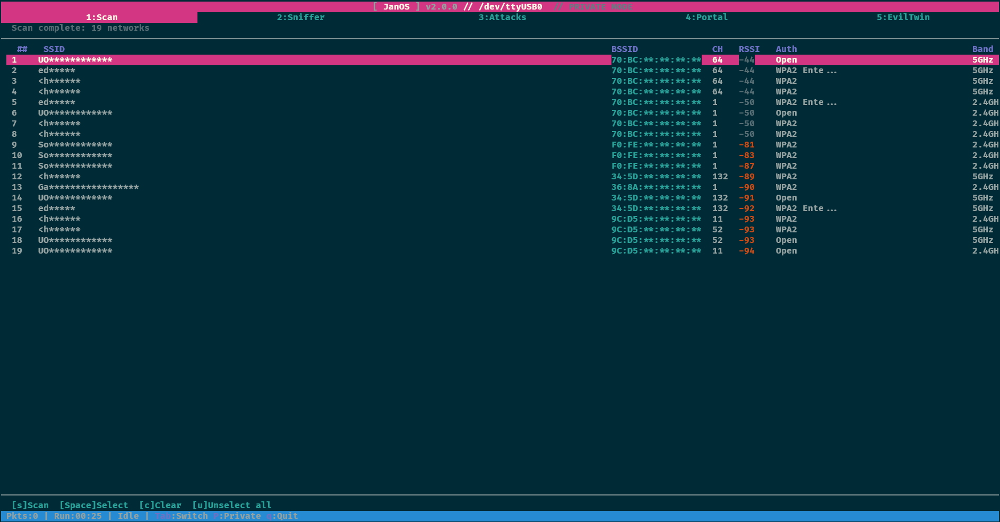
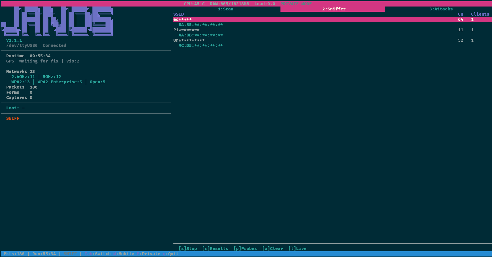
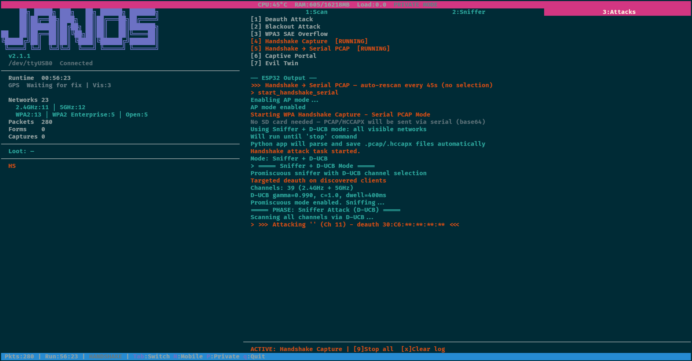
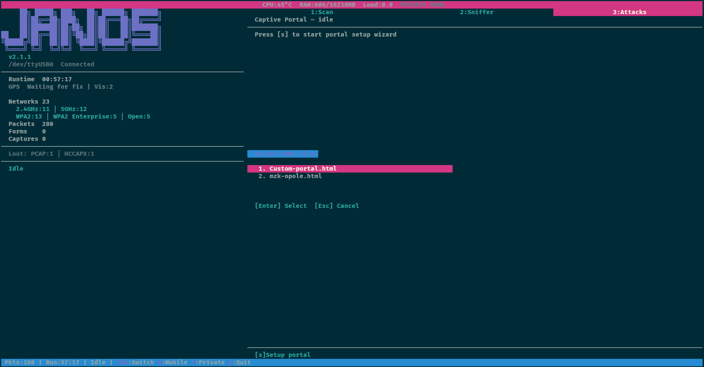

# JanOS-app

A Python TUI for controlling and interacting with **[projectZero](https://github.com/LOCOSP/projectZero)** on ESP32-C5 devices.

## TUI Mode

Full-screen terminal interface with tabbed navigation, real-time data, and keyboard-driven controls. Built with [urwid](https://urwid.org/) for maximum terminal compatibility (SSH, serial consoles, ClockworkPi).

### Screenshots

**Home** — sidebar with GPS status, loot counters, network breakdown:



**Scan** — network discovery with RSSI color coding and Private Mode:



**Sniffers** — live packet capture with AP/client tree and Private Mode:



**Handshake Serial PCAP** — D-UCB sniffer with targeted deauth, PCAP streamed via serial:



**Custom Captive Portal** — file picker for loading custom HTML portal pages:



### Install & Run
```bash
git clone https://github.com/LOCOSP/JanOS-app/
cd JanOS-app
./setup.sh                          # create .venv + install deps
./run.sh /dev/ttyUSB0               # run JanOS with ESP32
./run.sh                            # run without ESP32 (Advanced attacks only)
```

**Manual setup** (if you prefer):
```bash
python3 -m venv .venv
.venv/bin/pip install -r requirements.txt
.venv/bin/python3 -m janos /dev/ttyUSB0   # with ESP32
.venv/bin/python3 -m janos                # without ESP32
```

> **Note:** JanOS runs from a project virtual environment (`.venv/`). The `setup.sh` script creates it, installs all dependencies, and applies platform-specific fixes (e.g. Pi 5 GPIO shim). The auto-updater runs `setup.sh` after each `git pull` to keep everything in sync. `run.sh` will auto-run `setup.sh` on first launch if `.venv/` doesn't exist yet.

> **Raspberry Pi 5 / CM5:** The LoRa library (`LoRaRF`) requires GPIO access. On Pi 5, install the system shim first: `sudo apt install python3-rpi-lgpio python3-lgpio`. The `setup.sh` script detects Pi 5 and links the system packages into the venv automatically.

### Required Firmware

JanOS-app requires a compatible firmware on the ESP32-C5. The app communicates with the board over USB serial and needs features not available in the upstream projectZero firmware.

**Firmware releases:** [LOCOSP/projectZero](https://github.com/LOCOSP/projectZero/releases)

**Download the firmware binary:**
1. Go to the [latest release](https://github.com/LOCOSP/projectZero/releases/latest)
2. Download **`projectZerobyLOCOSP-X.Y.Z.zip`** (~4 MB) — contains `bootloader.bin`, `projectZerobyLOCOSP.bin`, `partition-table.bin`

**Flash the ESP32-C5:**
```bash
pip install --upgrade esptool pyserial
# Use JanOS built-in flasher (Add-ons tab, key 1) or manually:
esptool.py --chip esp32c5 --baud 460800 write_flash 0x2000 bootloader.bin 0x8000 partition-table.bin 0x20000 projectZerobyLOCOSP.bin
```

**In-app flash** (recommended): press `4` for Add-ons, then `1` for Flash Firmware. Downloads the latest release from GitHub and flashes automatically via esptool.

> **Note:** The upstream [C5Lab/projectZero](https://github.com/C5Lab/projectZero) releases and web flasher at [c5lab.github.io/projectZero](https://c5lab.github.io/projectZero/) provide the mainline firmware which does **not** include handshake serial capture, custom portal upload (`set_html`), or other features required by this app. Always use the firmware from [LOCOSP/projectZero releases](https://github.com/LOCOSP/projectZero/releases).

---

### Configuration

JanOS uses environment variables for optional cloud service credentials and hardware settings. Set them in your shell profile (`~/.bashrc`, `~/.zshrc`) or export before running JanOS.

#### WiGLE (wardriving upload + user stats)

To upload wardriving data and show WiGLE user stats in the sidebar:

1. Create an account at [wigle.net](https://wigle.net)
2. Go to **Account** > **API Token** > generate a new token
3. Set environment variables:
```bash
export JANOS_WIGLE_NAME="AID1234567890"    # your API Name (AIDxxxxx)
export JANOS_WIGLE_TOKEN="abcdef1234567890" # your API Token
```

When configured:
- **Wardriving screen**: press `[w]` after stopping to upload CSV files to WiGLE
- **Sidebar**: shows your WiGLE user stats (discovered WiFi/BT networks, rank) — refreshed hourly

#### WPA-sec (handshake upload)

To upload captured .pcap handshakes for cloud cracking:

1. Register at [wpa-sec.stanev.org](https://wpa-sec.stanev.org)
2. Copy your API key from the website
3. Set environment variable:
```bash
export JANOS_WPASEC_KEY="your-wpasec-key-here"
```

When configured:
- **Attacks tab**: press `[u]` to upload all .pcap files from loot to WPA-sec

#### GPS

GPS is auto-detected on startup. Default UART device: `/dev/ttyAMA0` at 9600 baud (standard for ClockworkPi uConsole with AIO v2 board).

The GPS device path and baud rate are defined in `janos/config.py`:
```python
GPS_DEVICE = "/dev/ttyAMA0"
GPS_BAUD_RATE = 9600
```

GPS provides:
- Geo-tagging for all loot types (handshakes, wardriving, BT devices, MeshCore nodes)
- Coordinates displayed in sidebar when fix is valid
- Privacy mode adds random noise (approx. 1km) to displayed coordinates (loot files are NOT affected)

#### Summary

| Variable | Purpose | Where to get it |
|----------|---------|-----------------|
| `JANOS_WIGLE_NAME` | WiGLE API Name | [wigle.net](https://wigle.net) > Account > API Token |
| `JANOS_WIGLE_TOKEN` | WiGLE API Token | Same as above |
| `JANOS_WPASEC_KEY` | WPA-sec API key | [wpa-sec.stanev.org](https://wpa-sec.stanev.org) |

---

### Keyboard Controls

#### Global
| Key | Action |
|-----|--------|
| `1`-`5` | Switch tabs (Scan, Sniffers, Attacks, Add-ons, Map) |
| `Tab` / `Shift+Tab` | Cycle tabs forward / backward |
| `Left` / `Right` | Switch tabs (D-pad navigation) |
| `Up` / `Down` | Navigate lists and tables |
| `Shift+M` | Toggle Mobile Mode (hide sidebar for small screens) |
| `Shift+P` | Toggle Private Mode (mask SSIDs, MACs, GPS, passwords) |
| `9` | Stop all running operations |
| `q` | Quit (confirmation prompt, sends stop to ESP32) |

#### Tab 1: Scan
| Key | Action |
|-----|--------|
| `s` | Start / stop WiFi scan |
| `Space` / `Enter` | Select network target |

#### Tab 2: Sniffers
| Key | Action |
|-----|--------|
| `1` | Wardriving WiFi (menu) |
| `2` | Wardriving BT (menu) |
| `3` | Packet Sniffer (menu) |
| `esc` | Back to sniffers menu |

**Wardriving WiFi / BT:**
| Key | Action |
|-----|--------|
| `s` | Start / stop wardriving |
| `x` | Clear results |
| `w` | Upload to WiGLE (when stopped, requires config) |

**Packet Sniffer:**
| Key | Action |
|-----|--------|
| `s` | Start / stop sniffer |
| `r` | Fetch AP results |
| `p` | Fetch probe requests |
| `l` | Switch to live view |
| `x` | Clear results |

#### Tab 3: Attacks
| Key | Action |
|-----|--------|
| `1`-`7` | WiFi attacks (deauth, blackout, SAE overflow, handshake, portal, evil twin) |
| `d` | Dragon Drain — WPA3 SAE Commit flood DoS (requires monitor mode adapter) |
| `m` | MITM — ARP spoofing man-in-the-middle (requires network adapter) |
| `b` | BLE Scan — discover Bluetooth LE devices |
| `t` | BT Tracker — track specific BLE device by MAC |
| `a` | AirTag Scanner — detect Apple AirTags + Samsung SmartTags |
| `u` | Upload .pcap handshakes to WPA-sec (requires config) |
| `x` | Clear log |

#### Tab 4: Add-ons
| Key | Action |
|-----|--------|
| `1` | Flash ESP32-C5 firmware (downloads latest from GitHub) |
| `2`-`5` | Toggle AIO v2 interfaces (GPS / LORA / SDR / USB) |
| `6` | LoRa Sniffer (single frequency listener) |
| `7` | LoRa Scanner (cycle EU868 + APRS 433 frequencies) |
| `8` | Balloon Tracker (APRS + UKHAS) |
| `9` | MeshCore Sniffer (869.618 MHz, AES-128 decryption) |
| `0` | Meshtastic Sniffer (869.525 MHz Medium Fast) |
| `s` | Stop current LoRa operation |

#### Tab 5: Map
| Key | Action |
|-----|--------|
| `arrows` | Pan the map |
| `+` / `-` | Zoom in / out |
| `0` | Reset to world view |
| `c` | Center on GPS loot points |
| `h` | Toggle handshake points (red) |
| `w` | Toggle WiFi points (green) |
| `b` | Toggle BT points (cyan) |
| `m` | Toggle MeshCore points (yellow) |
| `r` | Refresh loot data |

---

### Features

- **5-tab interface** — Scan, Sniffers, Attacks, Add-ons, Map
- **Sidebar panel** — ASCII logo, version, device status, runtime, GPS, loot counters (PCAP, HCCAPX, 22K, PWD, ET), wardriving WiFi/BT split, MeshCore nodes/msgs, BT devices, WiGLE user stats, AIO v2 status, animated creature
- **Header bar** — CPU temperature, RAM usage, load average, battery status (percent + voltage)
- **Creature animation** — ASCII art pet that reacts to app state (scanning, sniffing, attacking, BT hunting, LoRa listening, wardriving)
- **Mobile Mode** — `Shift+M` hides sidebar for small screens (SSH from phone, narrow terminals)
- **Private Mode** — `Shift+P` masks SSIDs, MACs, IPs, GPS, and passwords on screen (for recording/streaming). Loot files are NOT affected
- **Scan** — WiFi network discovery with RSSI color coding, band/auth breakdown, target selection
- **Sniffers** — menu with:
  - **[1] Wardriving WiFi** — continuous WiFi scan with GPS geo-tagging, dedup by BSSID (strongest RSSI), WiGLE-format CSV
  - **[2] Wardriving BT** — continuous BLE scan with GPS geo-tagging, dedup by MAC, saved to same WiGLE CSV with Type=BLE
  - **[3] Packet Sniffer** — live packet counter, AP/client results, probe requests
- **Attacks** — deauth, blackout, WPA3 SAE overflow, handshake capture, captive portal, evil twin, BLE scan, BT tracker, AirTag scanner — all in one tab
- **Dragon Drain** — WPA3 SAE Commit flood DoS (CVE-2019-9494), sends spoofed authentication frames with random ECC payloads to overwhelm AP computation. Requires external WiFi adapter in monitor mode
- **MITM** — ARP spoofing man-in-the-middle with live DNS/HTTP/credential capture and pcap logging. Supports single target, subnet scan, or all-devices mode. Auto-restores ARP tables on stop
- **Bluetooth** — BLE Scan (device discovery), BT Tracker (follow specific MAC), AirTag Scanner (Apple AirTags + Samsung SmartTags) — with GPS geo-tagged loot
- **Handshake Serial PCAP** — capture WPA handshakes without SD card, PCAP/HCCAPX streamed as base64 via serial and auto-saved to loot
- **WiGLE upload** — wardriving data (WiFi + BT) in WiGLE-compatible CSV, upload with `[w]` key. WiGLE user stats shown in sidebar (discovered networks, rank)
- **WPA-sec upload** — upload .pcap handshakes for cloud cracking with `[u]` key
- **Map tab** — vector world map rendered with Unicode braille characters, plots all GPS-tagged loot (handshakes=red, WiFi=green, BT=cyan, MeshCore=yellow), pan/zoom navigation, auto-hides sidebar for full width
- **Custom Captive Portals** — load custom HTML portal pages from `portals/` folder, send to ESP32 via chunked base64 serial transfer
- **Add-ons** — Flash ESP32 firmware, AIO v2 GPIO control (GPS/LORA/SDR/USB), LoRa tools (sniffer, scanner, balloon tracker, MeshCore, Meshtastic)
- **Auto-update** — checks GitHub for app + firmware updates on startup
- **Crash detection** — automatic firmware crash alert overlay with state reset
- **Serial event loop** — urwid `watch_file()` for non-blocking serial I/O
- **Loot system** — all captured data auto-saved to disk with GPS geo-tagging

---

### Loot System

Every session automatically saves captured data to `loot/<timestamp>/`:

```
loot/
  2026-03-13_15-30-00/
    serial_full.log           # every ESP32 serial line (timestamped)
    scan_results.csv          # networks found during scan
    sniffer_aps.csv           # access points from sniffer
    sniffer_probes.csv        # captured probe requests
    handshakes/               # .pcap, .hccapx, .22000, .gps.json from serial capture
      HomeWifi_aabbccddeeff_153042.pcap
      HomeWifi_aabbccddeeff_153042.hccapx
      HomeWifi_aabbccddeeff_153042.22000
      HomeWifi_aabbccddeeff_153042.pcap.gps.json
    wardriving.csv            # WiGLE-format: WiFi (Type=WIFI) + BT (Type=BLE) with GPS
    bt_devices.csv            # BLE devices from Attacks tab (MAC, name, RSSI, GPS)
    bt_airtag.log             # AirTag/SmartTag detection events
    meshcore_nodes.csv        # unique MeshCore nodes (type, name, GPS, RSSI)
    meshcore_messages.log     # MeshCore PUBLIC channel messages
    mitm/                     # MITM attack pcap captures
      capture_153042.pcap
    portal_passwords.log      # portal form submissions (passwords, emails)
    evil_twin_capture.log     # evil twin captured data
    attacks.log               # attack start/stop events
    session_info.txt          # session summary (written on exit)
```

**What is saved automatically:**
- **Full serial log** — every line from ESP32 with timestamp, always
- **Scan results** — CSV with SSID, BSSID, channel, auth, RSSI, band, vendor
- **Sniffer data** — APs (with client MACs) and probe requests as CSV
- **Handshakes** — binary .pcap and .hccapx files decoded from base64 serial stream (hashcat-ready)
- **HC22000 hashes** — `.22000` files auto-generated from complete handshakes (hashcat -m 22000), with GPS coordinates if available
- **GPS sidecars** — `.gps.json` files with latitude, longitude, altitude, satellite count for each handshake
- **Wardriving data** — WiGLE-format CSV with MAC, SSID/Name, AuthMode, channel, RSSI, GPS coordinates, Type (WIFI or BLE). Deduped by MAC, strongest RSSI kept
- **Portal passwords** — form submissions, usernames, emails
- **Evil Twin captures** — passwords, handshakes
- **BT devices** — Bluetooth LE devices with MAC, name, RSSI, GPS coordinates (from Attacks tab BLE Scan)
- **BT AirTag events** — detected Apple AirTags and Samsung SmartTags counts
- **MeshCore nodes** — unique nodes with type (Client/Repeater/Room/Sensor), name, GPS, RSSI/SNR (deduped by node ID)
- **MeshCore messages** — PUBLIC channel messages decrypted from AES-128 PSK
- **Attack events** — start/stop with target info

The loot path is displayed in the footer status bar. Each app launch creates a new session directory.

### Loot Dashboard

The sidebar shows current session and all-time loot:

```
Loot: PCAP:2 | HCCAPX:2 | 22K:2 | PWD:1       <- current session captures
WD   WiFi:134 | BT:232                          <- wardriving split (WiFi vs BLE)
MC   Nodes:5 | Msgs:12                          <- MeshCore (when active)
BT   Dev:8 | AT:2 | GPS:6                       <- BT loot (when active)
WiGLE W:25653 | B:8996 | #:142                  <- WiGLE user stats (when configured)
WiFi S:103 | PCAP:336 | 22K:8 | PWD:2           <- all-time WiFi totals
BT   Dev:48 | AT:7 | ST:2                        <- all-time BT totals
LoRa Nodes:12 | Msgs:45                          <- all-time LoRa totals
```

| Abbrev | Meaning |
|--------|---------|
| **S** | Total sessions with at least one capture |
| **PCAP** | Raw packet captures (`.pcap` files from handshake capture) |
| **HCCAPX** | Hashcat-ready handshake files (`.hccapx`) |
| **22K** | Hashcat hc22000 hash files (`.22000`, only from complete handshakes) |
| **PWD** | Passwords collected via captive portal submissions |
| **ET** | Evil Twin credential captures |
| **WD** | Wardriving entries (WiFi + BT split) |
| **Dev** | Bluetooth LE devices discovered |
| **AT** | Apple AirTags detected |
| **ST** | Samsung SmartTags detected |
| **MC** | MeshCore nodes/messages |
| **W/B/#** | WiGLE stats: WiFi discovered / BT discovered / user rank |

All-time totals are persisted in `loot/loot_db.json` and updated automatically after every capture. The database is rebuilt from existing session directories on first run.

---

### Custom Captive Portals

You can create your own captive portal HTML pages and deploy them to the ESP32 without reflashing firmware.

**How it works:**
1. Place `.html` files in the `portals/` directory (next to `janos/`)
2. In the Portal tab, press `s` to start the setup wizard
3. Enter SSID name for the fake access point
4. Choose `n` (No) when asked about built-in portal
5. Select your custom HTML from the file picker
6. The HTML is base64-encoded and sent to ESP32 via serial (`set_html` protocol)
7. Confirm to start — the portal serves your custom page

**Creating portal pages:**
- Must be a single self-contained HTML file (inline CSS/JS, no external resources)
- Form must POST to `/login` with a `password` field for credential capture
- Embedded images should use base64 data URIs
- Maximum size: ~768 KB (1 MB base64 buffer on ESP32 PSRAM)
- A sample `Custom-portal.html` is included in `portals/`

**Example form structure:**
```html
<form method="POST" action="/login">
  <input type="email" name="email" placeholder="Email">
  <input type="password" name="password" placeholder="Password">
  <button type="submit">Connect</button>
</form>
```

**Firmware requirement:** Requires JanOS firmware with `set_html` chunked protocol support — see [LOCOSP/projectZero releases](https://github.com/LOCOSP/projectZero/releases).

---

### Add-ons: Flash Firmware

The **Add-ons** tab (key `4`) provides a built-in firmware flasher for the ESP32-C5.

**How it works:**
1. Switch to the Add-ons tab (`4`)
2. Press `1` to start Flash Firmware
3. Confirm the dialog — JanOS closes the serial port, downloads the latest firmware release from GitHub, and flashes it via `esptool`
4. Live progress is shown in the log (download %, esptool output, flash status)
5. After flashing, esptool auto-resets the ESP32 via RTS/DTR and JanOS reconnects serial

**Requirements:** `esptool` must be installed (`pip install esptool`). The ESP32-C5 must be connected via a USB-UART bridge (e.g., CP2102N) that supports RTS/DTR auto-reset — no BOOT button or replug needed.

### Add-ons: AIO v2 Control

The **Add-ons** tab integrates with **[HackerGadgets AIO v2](https://github.com/hackergadgets/aiov2_ctl)** — a GPIO expansion module for ClockworkPi uConsole with 4 switchable interfaces: GPS (GPIO27), LORA (GPIO16), SDR (GPIO7), USB (GPIO23).

**Sidebar status** (below Loot section):
```
AIO  GPS:ON | LORA:OFF | SDR:OFF | USB:OFF
```

**Toggle interfaces** from the Add-ons tab:
1. Switch to Add-ons (`4`)
2. Press `2`-`5` to toggle GPS / LORA / SDR / USB on or off
3. Sidebar updates immediately, status auto-refreshes every 10 seconds

**Startup check** reports AIO v2 availability: `[OK] AIO v2 (pinctrl)` or `[--] AIO v2 not available`.

### Add-ons: LoRa SX1262

The **Add-ons** tab provides LoRa radio tools when the **LORA** GPIO interface is enabled (`[3] LORA [ON]`). Uses direct SPI communication with the SX1262 chip on the AIO v2 board via the `LoRaRF` library.

**Available tools** (keys `6`-`0`, visible only when LORA is ON):

| Key | Tool | Description |
|-----|------|-------------|
| `6` | **LoRa Sniffer** | Listen on a single frequency (default 868.1 MHz SF7 BW125k). Shows raw packets with hex + ASCII, RSSI, SNR |
| `7` | **LoRa Scanner** | Cycle through all EU868 (8 freqs) + APRS 433 (3 freqs) frequencies x 6 spreading factors. Detects any active LoRa transmissions |
| `8` | **Balloon Tracker** | Cycle LoRa APRS (433.775 SF12, 434.855 SF9) and UKHAS (868.1 SF8) profiles. Auto-parses APRS position/altitude and UKHAS CSV payloads |
| `9` | **MeshCore Sniffer** | EU/UK Narrow preset (869.618 MHz SF8 BW62.5k CR5). Decodes MeshCore packet headers, advertisements (node name, GPS), and public channel group messages (AES-128 decryption) |
| `0` | **Meshtastic Sniffer** | Medium Fast preset (869.525 MHz SF11 BW250k CR8). Captures Meshtastic packets with hex dump and printability detection |

**MeshCore decoder** parses the MeshCore mesh protocol (sync word 0x1424, 16-symbol preamble):
- **Header** — version, route type (Flood/Direct), payload type (Advert, GrpTxt, TextMsg, etc.)
- **Advertisements** — plaintext node info: public key, name, GPS coordinates, node type
- **Public channel messages** — AES-128-ECB decryption with known public PSK, shows sender name and message text
- Encrypted/binary payloads shown as hex with `[Encrypted]` tag

**Controls**: press the same key again or `s` to stop a running LoRa operation. Press a different sniffer key to switch directly (e.g. `0` while MeshCore is running switches to Meshtastic). Toggling LORA OFF auto-stops any running LoRa tool.

**Hardware**: SX1262 on `/dev/spidev1.0` (SPI bus 1, CS 0). IRQ=GPIO26, Busy=GPIO24, Reset=GPIO25. User must be in `spi` group.

### Map Tab

The **Map** tab (key `5`) renders a vector world map using Unicode braille characters (U+2800-U+28FF). Each character cell represents a 2x4 dot matrix, giving 2x horizontal and 4x vertical pixel resolution.

**Features:**
- Coastline from Natural Earth 50m dataset (~2250 points)
- Plots all GPS-tagged loot from all sessions: handshakes (red), WiFi wardriving (green), BT wardriving (cyan), MeshCore nodes (yellow)
- Pan with arrow keys, zoom with `+`/`-`, reset with `0`, center on points with `c`
- Toggle point types with `h`/`w`/`b`/`m`
- Auto-hides sidebar for full-width rendering
- Points twinkle randomly for visual effect

---

### Flags
```
./run.sh /dev/ttyUSB0 --debug    # Log to /tmp/janos.log
```

### Requirements
- Python 3.10+
- `urwid >= 2.1.0` — TUI framework
- `pyserial >= 3.5` — ESP32 serial communication
- `LoRaRF >= 1.4.0` — SX1262 SPI radio control (optional, for LoRa features)
- `cryptography` — AES decryption for MeshCore public channel (optional, for MeshCore sniffer)
- `requests` — HTTP client for WiGLE/WPA-sec uploads (optional, for cloud upload features)
- `scapy >= 2.5.0` — packet crafting/sniffing (optional, for Dragon Drain and MITM)
- `esptool >= 4.0` — ESP32 firmware flashing (optional, for Add-ons flash)
- Works on serial terminals, SSH, and ClockworkPi uConsole

## Desktop Shortcut (Fullscreen Launcher)

You can set up a desktop shortcut on ClockworkPi uConsole that launches JanOS in fullscreen (no window decorations):

**1. Create the launch script** (`janos-launch.sh` is included in the repo):
```bash
#!/bin/bash
cd "$(dirname "$0")"
exec lxterminal --title=JanOS --no-remote -e bash -c '.venv/bin/python3 -m janos /dev/ttyUSB0; read -p "Press Enter..."'
```
```bash
chmod +x janos-launch.sh
```

**2. Create a `.desktop` file** on the desktop (adjust paths to your install location):
```bash
JANOS_DIR="$(pwd)"  # run from the JanOS-app directory
cat > ~/Desktop/JanOS.desktop << EOF
[Desktop Entry]
Name=JanOS
Comment=WiFi Audit Tool for ESP32
Exec=$JANOS_DIR/janos-launch.sh
Icon=$JANOS_DIR/assets/janos-icon.svg
Terminal=false
Type=Application
Categories=Utility;Security;
StartupNotify=true
EOF
chmod +x ~/Desktop/JanOS.desktop
```

**3. Auto-fullscreen via labwc window rule** (Raspberry Pi OS Bookworm with Wayland):

Add to `~/.config/labwc/rc.xml` before `</openbox_config>`:
```xml
<windowRules>
  <windowRule title="JanOS">
    <action name="ToggleFullscreen"/>
  </windowRule>
</windowRules>
```
Then reload: `kill -SIGHUP $(pidof labwc)`

**4. Suppress "Execute File?" dialog** (optional):

Create `~/.config/libfm/libfm.conf`:
```ini
[config]
quick_exec=1
```
Then restart PCManFM: `killall pcmanfm` (it auto-respawns).

## Hardware

Designed for **ClockworkPi uConsole** with ESP32-C5-WROOM-1 connected via USB serial. The D-pad and keyboard map directly to TUI navigation.
