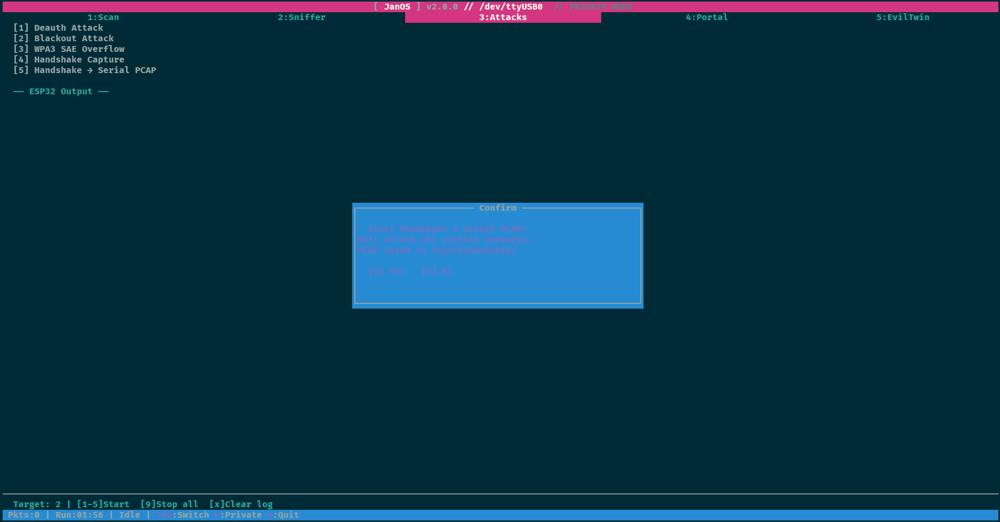

# JanOS-app


A Python TUI for controlling and interacting with **[JanOS](https://github.com/C5Lab/projectZero)** on ESP32-C5 devices.

## TUI Mode

Full-screen terminal interface with tabbed navigation, real-time data, and keyboard-driven controls. Built with [urwid](https://urwid.org/) for maximum terminal compatibility (SSH, serial consoles, ClockworkPi).

### Screenshots

**Scan tab** — network discovery with RSSI color coding and Private Mode:


**Handshake Serial Capture** — confirmation dialog before starting SD-less capture:



**Handshake Serial PCAP** — live D-UCB sniffer with targeted deauth, PCAP streamed via serial:


### Install & Run
```bash
git clone https://github.com/LOCOSP/JanOS-app/
cd JanOS-app
pip install -r requirements.txt
python3 -m janos /dev/ttyUSB0
```

### ⚠️ Required Firmware

JanOS-app requires a compatible firmware on the ESP32-C5. The app communicates with the board over USB serial and expects the command set from the **`feature/handshake-serial`** branch.

**Firmware repository:** [LOCOSP/projectZero — feature/handshake-serial](https://github.com/LOCOSP/projectZero/tree/feature/handshake-serial)

**Download the firmware binary:**
1. Open the [latest CI build](https://github.com/LOCOSP/projectZero/actions/runs/22720592665) (or go to [Actions](https://github.com/LOCOSP/projectZero/actions) → pick the latest green run on `feature/handshake-serial`)
2. Scroll to the **Artifacts** section at the bottom of the run page
3. Download **`esp32c5-firmware`** (~4 MB ZIP) — contains `bootloader.bin`, `projectZero.bin`, `partition-table.bin`, `oui_wifi.bin`, and `flash_board.py`

**Flash the ESP32-C5:**
```bash
pip install --upgrade esptool pyserial
python flash_board.py --port /dev/ttyUSB0          # Linux
python flash_board.py --port COM10                 # Windows
python flash_board.py --port /dev/ttyUSB0 --erase  # full erase before flash
```

> **Note:** The upstream [C5Lab/projectZero](https://github.com/C5Lab/projectZero) releases and web flasher at [c5lab.github.io/projectZero](https://c5lab.github.io/projectZero/) provide the mainline firmware which does **not** include handshake serial capture, custom portal upload (`set_html`), or other features required by this app. Always use the `feature/handshake-serial` branch from the LOCOSP fork.

### Keyboard Controls
| Key | Action |
|-----|--------|
| `1-3` | Switch tabs (Scan, Sniffer, Attacks) |
| `Tab` / `Shift+Tab` | Cycle tabs forward / backward |
| `Left` / `Right` | Switch tabs (D-pad navigation) |
| `Up` / `Down` | Navigate lists and tables |
| `s` | Start scan / sniffer / setup wizard (context-dependent) |
| `Space` / `Enter` | Select / toggle item in tables (auto-sends to ESP32) |
| `r` | Fetch sniffer AP results |
| `p` | Fetch probe requests |
| `l` | Switch to live sniffer view |
| `x` | Clear results / clear log (context-dependent) |
| `d` | Show captured data (Portal / Evil Twin) |
| `Shift+M` | Toggle Mobile Mode (hide sidebar for small screens) |
| `Shift+P` | Toggle Private Mode (mask SSIDs, MACs, IPs, passwords) |
| `9` | Stop all running operations |
| `q` | Quit (confirmation prompt, sends stop to ESP32) |

### Features
- **Sidebar panel** -- left-side panel with JanOS ASCII logo, version, device status, runtime, loot counters (PCAP, HCCAPX, PWD, ET), network breakdown by band (2.4/5GHz) and auth type (WPA2/WPA3/Open)
- **Header bar** -- system stats: CPU temperature, RAM usage, load average
- **Mobile Mode** -- press `Shift+M` to hide the sidebar and go full-width for small screens (SSH from phone, narrow terminals)
- **Scan** -- scan networks, browse results with RSSI colors, select targets via keyboard
- **Sniffer** -- live packet counter, AP/client results, probe requests
- **Attacks** -- deauth, blackout, WPA3 SAE overflow, handshake capture, captive portal, evil twin — all in one tab with sub-screen navigation
- **Handshake Serial PCAP** -- capture WPA handshakes without SD card, PCAP/HCCAPX streamed as base64 via serial and auto-saved to loot
- **Handshake auto-rescan** -- when no network is selected, periodically rescans (45s cycle) so ESP32 discovers fresh networks as you move
- **Custom Captive Portals** -- load custom HTML portal pages from local `portals/` folder and send to ESP32 via chunked base64 serial transfer (see below)
- **Crash detection** -- automatic firmware crash alert overlay with state reset, dismissable with any key
- **Serial event loop** -- no background threads, uses urwid `watch_file()` for non-blocking serial I/O
- **Loot system** -- all captured data auto-saved to disk (see below)
- **Private Mode** -- press `Shift+P` to mask SSIDs, MACs, IPs, and passwords on screen (for recording/streaming). Loot files are NOT affected

### Loot System

Every session automatically saves captured data to `loot/<timestamp>/`:

```
loot/
  2025-03-04_15-30-00/
    serial_full.log           # every ESP32 serial line (timestamped)
    scan_results.csv          # networks found during scan
    sniffer_aps.csv           # access points from sniffer
    sniffer_probes.csv        # captured probe requests
    handshakes/               # .pcap and .hccapx from serial capture
      HomeWifi_aabbccddeeff_153042.pcap
      HomeWifi_aabbccddeeff_153042.hccapx
    portal_passwords.log      # portal form submissions (passwords, emails)
    evil_twin_capture.log     # evil twin captured data
    attacks.log               # attack start/stop events
    session_info.txt          # session summary (written on exit)
```

**What is saved automatically:**
- **Full serial log** -- every line from ESP32 with timestamp, always
- **Scan results** -- CSV with SSID, BSSID, channel, auth, RSSI, band, vendor
- **Sniffer data** -- APs (with client MACs) and probe requests as CSV
- **Handshakes** -- binary .pcap and .hccapx files decoded from base64 serial stream (hashcat-ready)
- **Portal passwords** -- form submissions, usernames, emails
- **Evil Twin captures** -- passwords, handshakes
- **Attack events** -- start/stop with target info

The loot path is displayed in the footer status bar. Each app launch creates a new session directory.

### Custom Captive Portals

You can create your own captive portal HTML pages and deploy them to the ESP32 without reflashing firmware.

**How it works:**
1. Place `.html` files in the `portals/` directory (next to `janos/`)
2. In the Portal tab, press `s` to start the setup wizard
3. Enter SSID name for the fake access point
4. Choose `n` (No) when asked about built-in portal
5. Select your custom HTML from the file picker
6. The HTML is base64-encoded and sent to ESP32 via serial (`set_html` protocol)
7. Confirm to start — the portal serves your custom page

**Creating portal pages:**
- Must be a single self-contained HTML file (inline CSS/JS, no external resources)
- Form must POST to `/login` with a `password` field for credential capture
- Embedded images should use base64 data URIs
- Maximum size: ~768 KB (1 MB base64 buffer on ESP32 PSRAM)
- A sample `Custom-portal.html` is included in `portals/`

**Example form structure:**
```html
<form method="POST" action="/login">
  <input type="email" name="email" placeholder="Email">
  <input type="password" name="password" placeholder="Password">
  <button type="submit">Connect</button>
</form>
```

**Firmware requirement:** Requires JanOS firmware with `set_html` chunked protocol support (branch `feature/handshake-serial` on [projectZero](https://github.com/LOCOSP/projectZero)).

### Flags
```
python3 -m janos /dev/ttyUSB0 --debug    # Log to /tmp/janos.log
python3 -m janos /dev/ttyUSB0 --legacy   # Fall back to old CLI
```

### Requirements
- Python 3.10+
- `urwid >= 2.1.0`
- `pyserial >= 3.5`
- Works on serial terminals, SSH, and ClockworkPi uConsole

## Legacy CLI Mode

The original `JanOS_app.py` is still available as a standalone script:

```bash
chmod +x JanOS_app.py
python3 JanOS_app.py /dev/ttyUSB0
```

## Desktop Shortcut (Fullscreen Launcher)

You can set up a desktop shortcut on ClockworkPi uConsole that launches JanOS in fullscreen (no window decorations):

**1. Create the launch script** (`janos-launch.sh` is included in the repo):
```bash
#!/bin/bash
cd "$(dirname "$0")"
exec lxterminal --title=JanOS --no-remote -e bash -c 'python3 -m janos /dev/ttyUSB0; read -p "Press Enter..."'
```
```bash
chmod +x janos-launch.sh
```

**2. Create a `.desktop` file** on the desktop (adjust paths to your install location):
```bash
JANOS_DIR="$(pwd)"  # run from the JanOS-app directory
cat > ~/Desktop/JanOS.desktop << EOF
[Desktop Entry]
Name=JanOS
Comment=WiFi Audit Tool for ESP32
Exec=$JANOS_DIR/janos-launch.sh
Icon=$JANOS_DIR/assets/janos-icon.svg
Terminal=false
Type=Application
Categories=Utility;Security;
StartupNotify=true
EOF
chmod +x ~/Desktop/JanOS.desktop
```

**3. Auto-fullscreen via labwc window rule** (Raspberry Pi OS Bookworm with Wayland):

Add to `~/.config/labwc/rc.xml` before `</openbox_config>`:
```xml
<windowRules>
  <windowRule title="JanOS">
    <action name="ToggleFullscreen"/>
  </windowRule>
</windowRules>
```
Then reload: `kill -SIGHUP $(pidof labwc)`

**4. Suppress "Execute File?" dialog** (optional):

Create `~/.config/libfm/libfm.conf`:
```ini
[config]
quick_exec=1
```
Then restart PCManFM: `killall pcmanfm` (it auto-respawns).

## Hardware

Designed for **ClockworkPi uConsole** with ESP32-C5-WROOM-1 connected via USB serial. The D-pad and keyboard map directly to TUI navigation.
